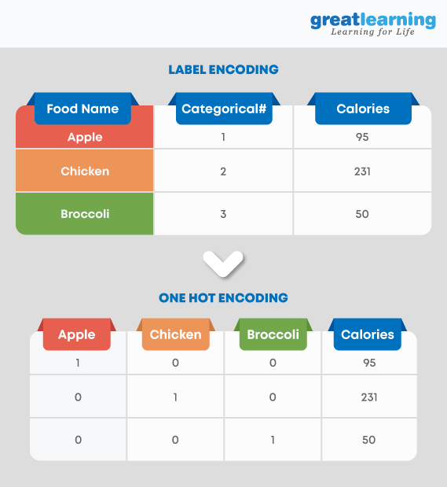

# Revision Notes

#### 1. Explain the terms Artificial Intelligence (AI), Machine Learning (ML), and Deep Learning.
- **Artificial Intelligence (AI):** The concept of machines performing tasks in a way that mimics human intelligence.
- **Machine Learning (ML):** A subset of AI where machines learn from data to make predictions or decisions.
- **Deep Learning:** A specialized subset of ML using layered neural networks to learn from vast amounts of data.

#### 2. What are the different types of Learning/Training models in ML?
- **Supervised Learning:** Learning from labeled data to predict outcomes.
- **Unsupervised Learning:** Finding hidden patterns in unlabeled data.
- **Semi-supervised Learning:** Combines both labeled and unlabeled data for training.
- **Reinforcement Learning:** Learning through trial and error, using feedback from actions.

#### 3. What is the difference between deep learning and machine learning?
- **Machine Learning:** Utilizes algorithms to parse and learn from data.
- **Deep Learning:** A branch of ML that employs deep neural networks, enabling the automatic learning of data representations.

#### 4. What is the main key difference between supervised and unsupervised machine learning?
- **Supervised Learning:** Uses labeled data for training.
- **Unsupervised Learning:** Works with unlabeled data, discovering inherent patterns.

#### 5. How do you select important variables while working on a data set?
- Identify and discard correlated variables before finalizing on important variables
- The variables could be selected based on ‘p’ values from Linear Regression
- Forward, Backward, and Stepwise selection
- Lasso Regression
- Random Forest and plot variable chart
- Top features can be selected based on information gain for the available set of features.

#### 6. There are many machine learning algorithms till now. If given a data set, how can one determine which algorithm to be used for that?
- Look at application to categorise what algorithmn to use

#### 7. How are covariance and correlation different from one another?
- **Covariance:** Indicates the direction of the linear relationship between two variables.
- **Correlation:** Measures both the direction and strength of the linear relationship between two variables.

#### 8. State the differences between causality and correlation.
- **Correlation:** A measure of association between two variables, without implying cause.
- **Causality:** Indicates a cause-and-effect relationship between variables.

#### 9. We look at machine learning software almost all the time. How do we apply Machine Learning to Hardware?
We have to build ML algorithms in System Verilog which is a Hardware development Language and then program it onto an FPGA to apply Machine Learning to hardware.

#### 10. Explain One-hot encoding and Label Encoding. How do they affect the dimensionality of the given dataset?

- **One-hot Encoding:** Creates binary columns for each category, leading to a sparse matrix.
  - Increases the dimensionality of the dataset.
- **Label Encoding:** Assigns a unique integer to each category value.
  - Does not increase the dataset's dimensionality.

### What Does Ordinal Mean?
- **Ordinal:** Refers to data that has a clear ranking or order, like sizes (small < medium < large).

### One-hot Encoding

**Benefits:**
- Avoids ordinal assumptions in models. Providing categories as numbers (e.g., 1, 2, 3) could lead models to assume an ordinal relationship where none exists.
- Easier for models to interpret.

**Downsides:**
- Increases feature count significantly.
- Results in sparse matrices.

**When to Use:**
- With nominal data (no natural order).
- If categories are few.

### Label Encoding

**Benefits:**
- More compact dataset.
- Straightforward to apply.

**Downsides:**
- Might imply false order in data.
- Not suitable for all model types.

**When to Use:**
- With ordinal data (natural order exists).
- For models like decision trees.

### Embedding

Also embeddings is another way to vectorise the words. Similar to one-hot encoding but much less binary. In a real-world scenario using models like Word2Vec or GloVe trained on a large corpus:

Words like "king" and "queen" would have vectors closer to each other in the multidimensional space, reflecting their semantic similarity (both are royalty).
Both "king" and "queen" would be farther from "man" in certain dimensions (those capturing royal status), but "king" and "man" might be closer in others (if those capture gender, assuming a simplistic and binary view of gender).
To actually obtain such embeddings, one would typically use a pre-trained model or train their own model on a specific corpus. Tools like Gensim in Python make it relatively straightforward to work with pre-trained word embeddings or to train your model on your text data. 

