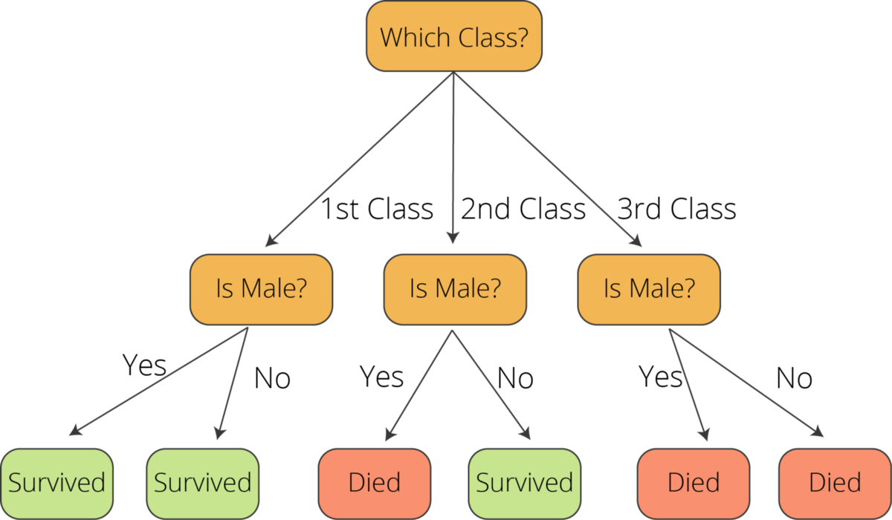

# Decision Tree #

This method can be used both in classification and regression. A decision tree creates a number of conditions/internal nodes which creates a split (branch) of which the end will be a leaf (final decision).

A good illustration is the titanic dataset decision tree. 



The tree is drawn upside down with the root at the top and the leafs at the bottom. The decisions that have higher __feature importance__ are set near the roots. 

The algorithmn has a few techniques to figure out which features are the most important, one of them is __Recursive Binary Splitting__
## Recursive Binary Splitting ##

In the case of the titanic dataset we have a few features. The algorithmn will calculate how much accuracy is lost each split will cost us using a function. The split that costs the least is the sex, so we set the root node to the sex of the passengers.

The calcualtions in recursive binary splitting is different for regression and classification.

```
Regression cost = sum(y - prediction)^2
```

There are other cost functions but they all do the same thing. The above function is applied to all data points and the cost is calculated for every split. 

```
Classification cost = sum(pk*(1-pk))
```
pk represents the proportion of classes that are in the same group. For example, using our titanic dataset the %age of survived in the same category. A perfect class putrity would be 1, whereas a binary classfication would be 0.5. This would be the worst outcome of the model. 

## Stop Splitting ##

One problem usually faced is when to stop growing a tree. It is possible to overfit a tree, if we have a system with a large set of features it results in a large number of splits, which in turn gives a huge tree. 

One way to prevent this is by setting a minimum number of training inputs on each leaf. For example, we can use a minimum of 10 passengers to reach a decision. Another way is to set a maximum depth of the model, so the model cannot go over a certain number of decision nodes.

## Pruning ##

The performance of a tree can also be improved through pruning. This is where we remove the branches that make use of features having low importance. This reduces complexity and overfitting. Two main methods:

- Reduced Error Pruning: Where we remove each node and see how it impacts accuracy. If the accurancy does not deteriorate the change is kept
- Cost Complexity Pruning: More complex algorithm to weight whether nodes can be removed based on the size of the sub-tree. Also known as weakest link pruning

These algorthmns have some advantages and disadvantages:

### Advantages ###

- Simple to understand, interpret, visualize.
- Decision trees implicitly perform variable screening or feature selection.
- Can handle both numerical and categorical data. Can also handle multi-output problems.
- Decision trees require relatively little effort from users for data preparation.
- Nonlinear relationships between parameters do not affect tree performance.

### Disadvantages ### 

- Decision-tree learners can create over-complex trees that do not generalize the data well. This is called overfitting.
- Decision trees can be unstable because small variations in the data might result in a completely different tree being generated. This is called variance, which needs to be lowered by methods like bagging and boosting which are emsemble technique. 
- Greedy algorithms cannot guarantee to return the globally optimal decision tree. This can be mitigated by training multiple trees, where the features and samples are randomly sampled with replacement.
- Decision tree learners create biased trees if some classes dominate. It is therefore recommended to balance the data set prior to fitting with the decision tree.

# Random Forests #

This algorithmn uses many decision trees and then takes the overall output from these decisions. This also can be used in classifiers and regression. Usually in a the case of regression the forest will output the average of the individual trees. 

The process is as follows

- Pick at random k data points from the training set.
- Build a decision tree associated to these k data points.
- Choose the number N of trees you want to build and repeat steps 1 and 2.
- For a new data point, make each one of your N-tree trees predict the value of y for the data point in question and assign the new data point to the average across all of the predicted y values.

