# Deep Leaning & Neural Networks #

This is some notes on the theory behind deep learnig and neural networks. Below is a graphic highlighting the principle behind neural networks. In this specific example the network has been designed to analyse and return hand written numbers.

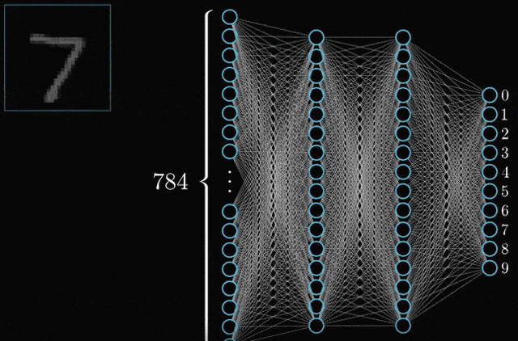

The first layer of the network is simply the pixel value greyscale of the image, that has 28 x 28 pixels = 784. The idea is that each neuron fires upon the activation of another neuron. The layers inbetween the output and the first layer is known as hidden layers.

In the case of the numbers, each neuron is picture of 784 pixels. These images are connected by lines which are called weights. To start, the model will arbitrarily assign the weight figures to begin the learning process. 

The neuron will be activated when the activation function (which is a weighted sum) is greater than 10 (this figure depends on the size of the network).  

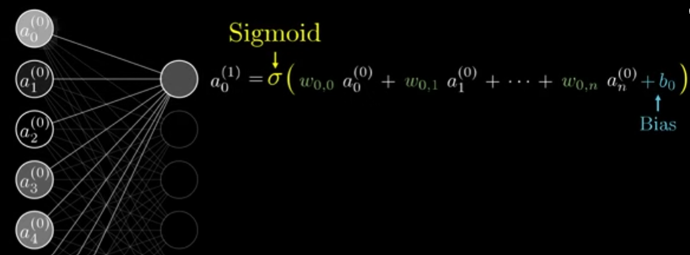

In this equation:

- w = weights
- The numbers in brackets (0) represent the activation values in the layer before
- b = a bias input that allows the computer to futher influence the values of neurons
- The sigmoid function is used as it will convert this potentially very large or very negative number into a probability bertween 0 and 1

The computer will crunch these activation values using matrix vector calcualtions:

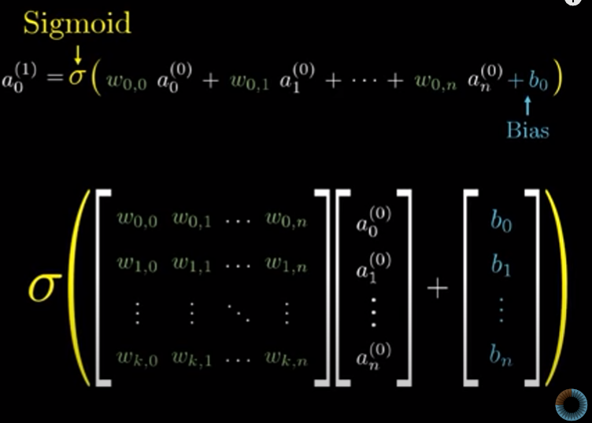

The weights will be stored as a matrix, with the previous layers activations stored as a vector. The bias will then be added as adn additional vector.

This can be summarised by a simple equation with W representing the weight matrix, a(0) as the activations in layer 0 and b as the bias

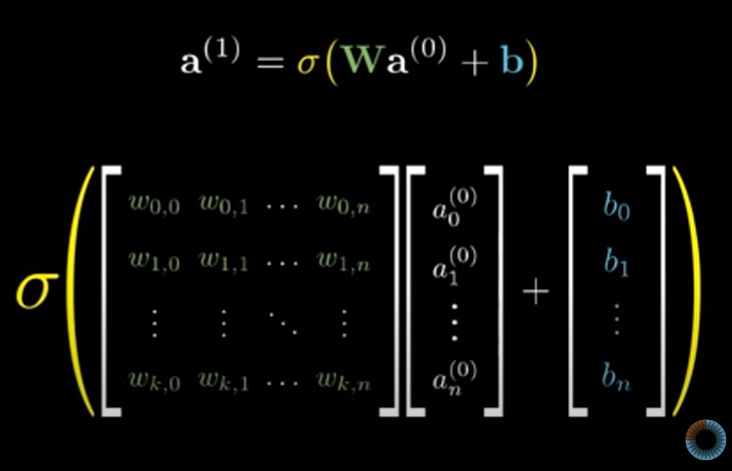

There are many libraries that have optimised matrix manipulations, hence why they are used. It is helpful to think of the neuron as a function that takes in values of all the neurons in the previuos layer and returns a number between 0 and 1.

There are a number of different activation functions. Here is a list of a few:

- Binary Step function has a steep step from 0 to 1, good for classification problems.
- Hyperbolic tangent functions, creates outputs between -1 and 1 instead of 0 and 1. 
- Rectified Linear Unit (ReLU) which is a relatively simple function that assumes everything below x=0 is y=0 and everything above x=0 is then linear with the activation function. ReLU is very good when dealing with the problem of a vanishing gradient. 


You can find a full list of activation functions [here](https://en.wikipedia.org/wiki/Activation_function) and [here](https://towardsdatascience.com/everything-you-need-to-know-about-activation-functions-in-deep-learning-models-84ba9f82c253#:~:text=Simply%20put%2C%20an%20activation%20function,fired%20to%20the%20next%20neuron.)

## Training Data ##

So that is the underlying mathematics, but how does this process learn and improve. Neural networks are a supervised learning model, the model is trained using training data (trian, test, split).

Remember that each neuron is connected to a neuron in the previous layer with the weights indicating how strong these connections are. These weights and biases are assigned randomly. This means that the output will be nonsense to being with, with the aim of improving.

This is done by creating a __cost__ function. This function will take the difference between the squares of the ouputs and desired output to grade how successful the prediction has been. This is known as a cost of a training program.

The algorithm will take the average the cost values over the entire training data. This final number is small when succesful and large when unsucessful. 

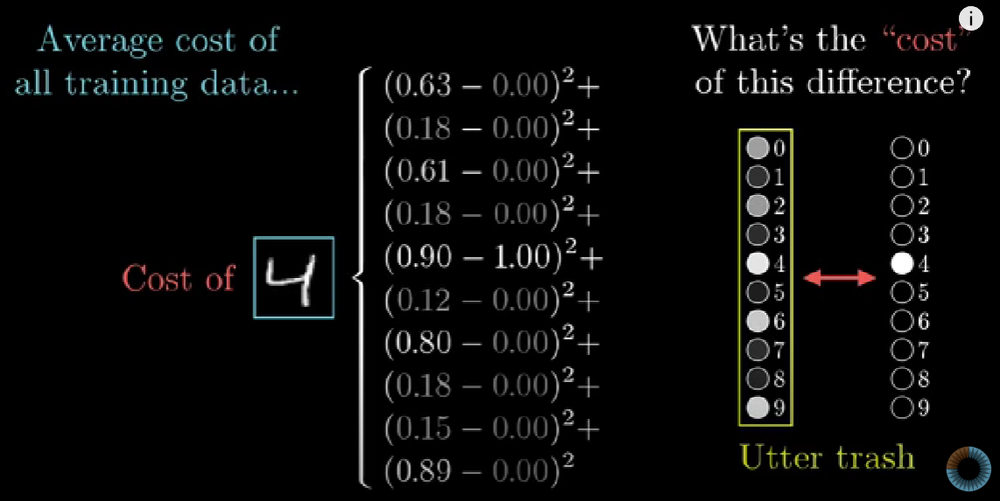

The computer then needs to find a way to find the minumum weights and bias of this complex function. You can think of this function as a potential energy map. 

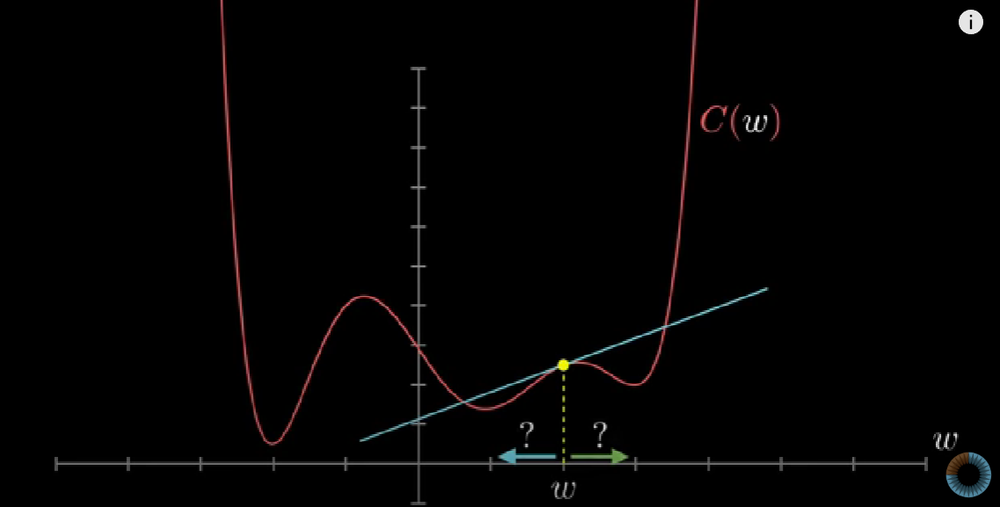

The program will then calculate the slope (be it in thousands of dimensions rather than 2) and move the functions closer to the minima. However, we have a problem which is that we are unsure what is a local minimum or a global minimum. The process of reducing the cost function through weights and biases is known as gradient reduction.

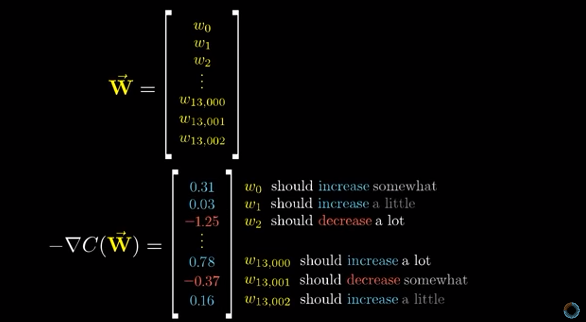

The values are multiplied by a vector that informs the magnitude and amount the weights/biases need to change.It is worth noting that you make think each layer looks like a number, when in fact the layers look closer to this:

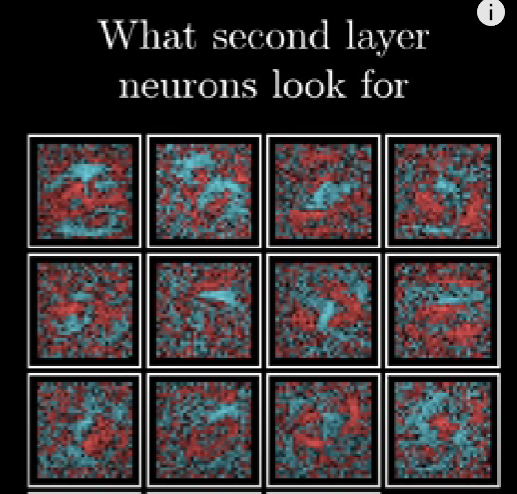

Additionally the system would be terrible at telling you what a five looks like.

## Back Propogation ##

If we think about it, the process of changing the output result of a neuron means changing the weights of all the neurons in the previous layer. 

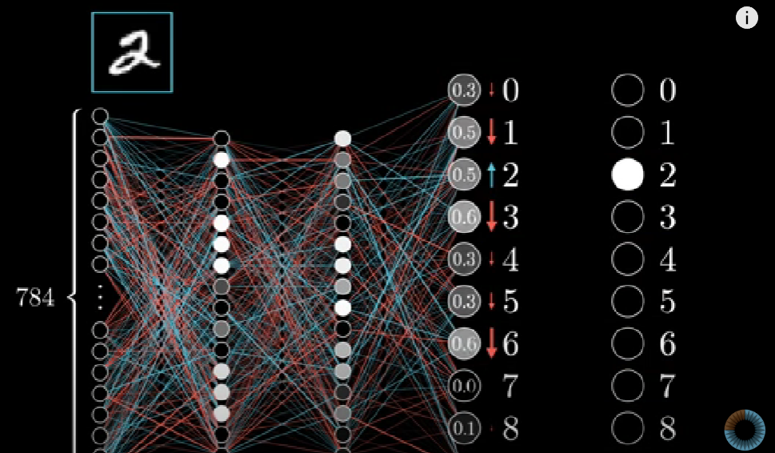

These weights are then averaged over what the computer would like to see as desired changes.

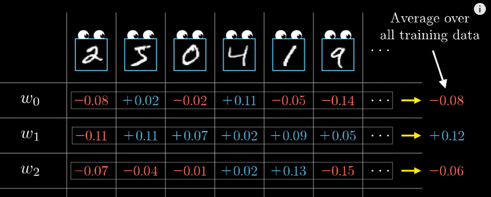

This process can be very computationally slow, so what the algorithm does is randomise the data set divide this huge data set into mini batches. 

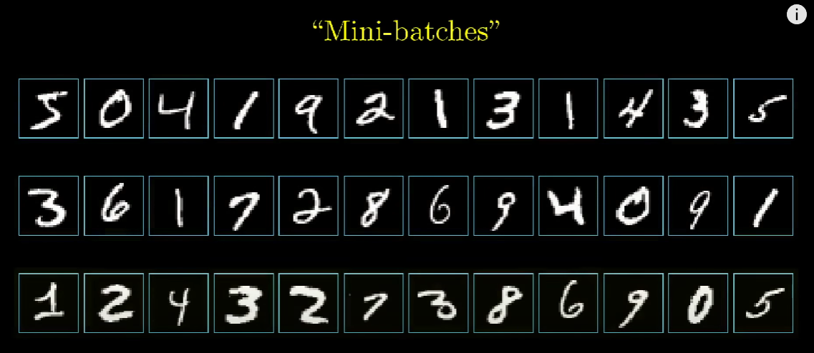

The computer will then process the weight changes for each of these mini-batches. Because of the nature of these mini batches the position on the cost surface will sometimes go up but will generally trend downwards. This process is known as a stochastic gradient descent.  

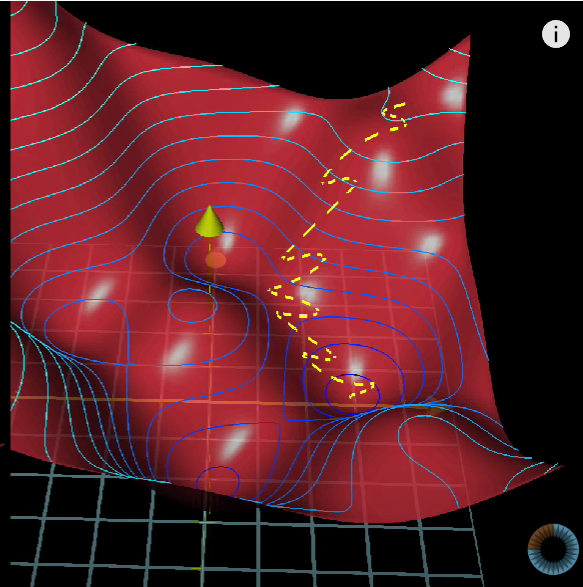

## Implementation ## 

Exclusive and Non-Exclusive categories. In the case of the numbers, we have a exclusive class, where there is only one answer. In the case of Non-exclusive we can have multiple answers, for which we have an probability limit of around 50%.

Scaling the data in a neural network will make the training steps faster. Scaling the features makes the flow of gradient descent smooth and helps algorithms quickly reach the minima of the cost function. Without scaling features, the algorithm may be biased toward the feature which has values higher in magnitude.

Here is the code behind a neural network. First we import sklearn and tensor flow packages, tensor flow is the package that builds the neural network.
```python
import pandas as pd
from sklearn.model_selection import train_test_split
from sklearn.preprocessing import MinMaxScaler
import matplotlib.pyplot as plt
from sklearn.metrics import r2_score 
import datetime
from scipy.stats import linregress

from tensorflow.keras.models import Sequential
from tensorflow.keras.layers import Dense

```

We then convert our data into .values as the neural network needs to take in data in a list format.

```python
result = pd.read_csv(r'C:\Projects\cadent_gas_leak\ml_data\training_data_final.csv')

col_list = result.columns.to_list()
col_list.remove('date')
col_list.remove('incidents')
print(col_list)

X = result[col_list].values

y = result[['incidents']].values
```

We then test/train/split our data for the neural network to test against and categorise. As test size of between 20-30% is optimal, any smaller than that and the network struggles to categorise.

```python
X_train, X_test, y_train, y_test = train_test_split(X,y, test_size = 0.2)

scaler = MinMaxScaler()
scaler.fit(X_train)

X_train = scaler.transform(X_train)
X_test = scaler.transform(X_test)
```

We then create the neural network model. The first command is where we initialise the model and the second command is where we create the layers. For continious problems we set the last layer to have one neuron, if you have a categorisation problem you set it to the number of categories you're expecting.

```python
model = Sequential()

model.add(Dense(40, activation='relu'))
model.add(Dense(40, activation='relu'))
model.add(Dense(40, activation='relu'))
model.add(Dense(20, activation='relu'))
model.add(Dense(20, activation='relu'))
model.add(Dense(20, activation='relu'))
model.add(Dense(1, activation='relu'))
```

We then compile these layers, fit the model and evaluate. 

```python
model.compile(optimizer='rmsprop', loss='mse')
model.fit(x = X_train, y = y_train, epochs=5000, verbose=1)

rme_result = model.evaluate(X_test,y_test,verbose=0)

```

In order to then predict the model with some test data we use the __predict()__ keyword. We then convert this into a pandas dataframe using the __reshape()__ (which gives new shape to a data without changin it's data) keyword and then cycle through that list using a for loop. 

```python
scaler = MinMaxScaler()
scaler.fit(X)
X = scaler.transform(X)

nn_prediction = model.predict(X)

test_predictions = pd.Series(nn_prediction.reshape(len(y),))
test_output = []

for x in range(0, len(test_predictions)): 
    
    test_output.append(test_predictions[x])

```

For the avoidance of confusion, the first X_test is test the convergance of the model. The second test data is completely unseen data to see how the model performs in the real world.

## Expolding and Vanashing Gradient  Problem ##

The vanishing gradient can happen when using a sigmoid or tanh function. We we go back in each layer through back propagation the weight updates are exponetially small. This leads to long training times and poor accuracy. 

Remeber the results of these functions are the derivaties. This figures illustrates the problem. We can see that for certain extremely large values the function output can be infinitely small. This is not the case for RELU which rapidly approachs one with large values.

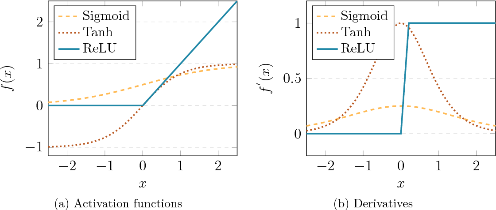

Rememebr we take the derivative of the function to inform the gradient descent. Therefore you can fix this problem by using a RELU function

Conversely exploding gradients is down to the weights of the neural network. Remember the equation for the activation function in each layer


