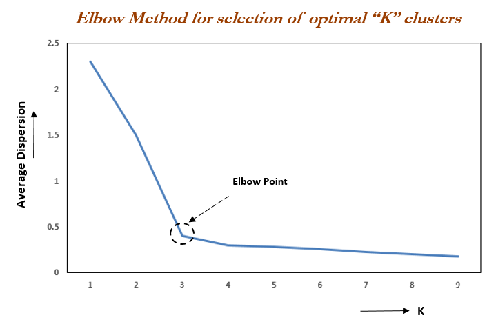
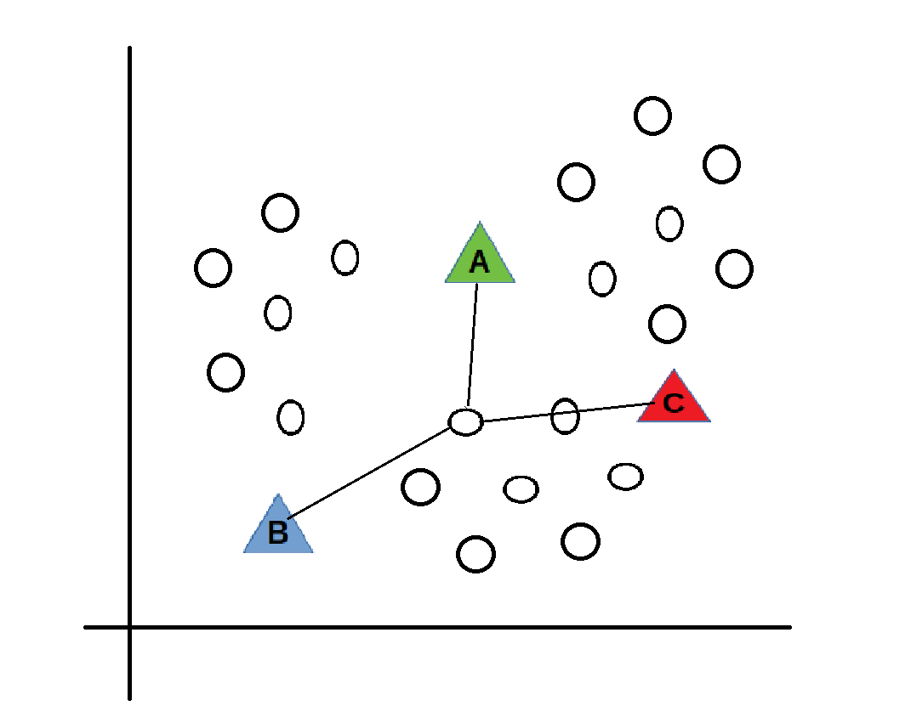
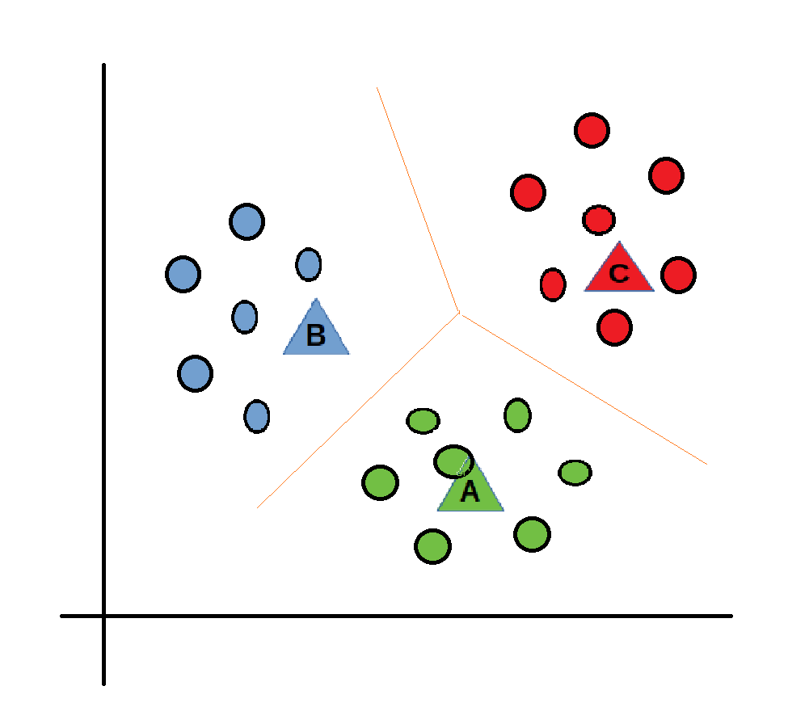

# K-Nearest Neighbours & K-Means Clustering

## K-Nearest Neighbours

Supervised maching learning algorithmn mainly used to solve classification predictive problems. The algorithm works in three stages:

K = to the number of neighbours you would like to look up and classify. As you increase the number K you are increasing the number of values you look up.

This algorithm is very simple, has easy training data, has low parameters (K and distance metric = defining the distance between test points and training points).

However these is a high prediction cost, because you are having to sort large amounts of data sets. Additionally the model does not deal with high  dimensionality.

## K-Means Clustering

Unsupervised algorithmn that takes in no training data and clusters groups of data into distinct groups. This can be used for things like:

- Identify crime localities
- Rideshare analysis

The algorithm works by first choosing the number of clusters you'd like to work with K. We can decide the number of clusters by using the elbow method:

Once we've identified the number of clusters the algorithm will place these in random places across the graph.

The algorithm will calculate the distance between each data point and the centriods. The centriods position is the recalcualted as the average position of the data points it is closest to. This is repeated until there are no further changes

There are some disadvatanges to this algorithmn:

- It is sensitive to outliers
- Choosing the k means can be tough manually
- As the number of dimensions increase it's scabality icreases
