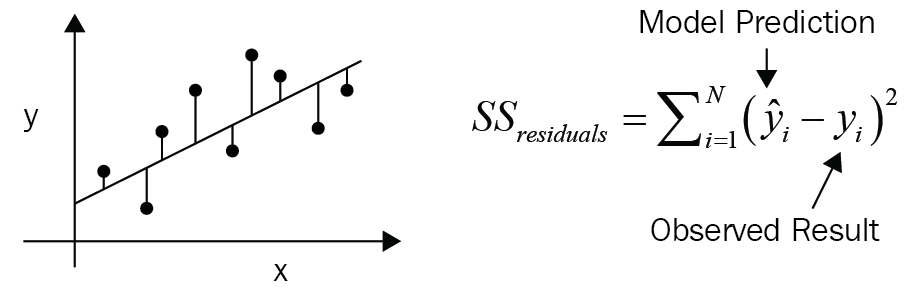
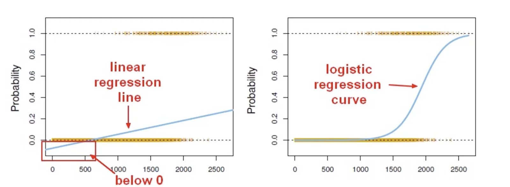
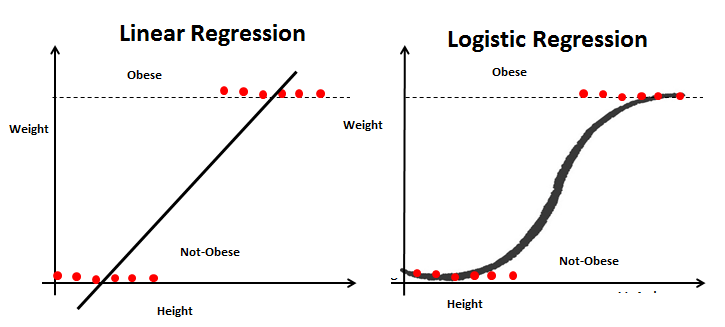

# Logistics and Linear Regression Notes

## General ML Concepts ##

- Confuision Matrix is a table that shows Positive Negative Comparison (TP, FP, TN, FN)

- Supervised learning algoritmns are trained using labeled data. The goal is to train a model to predict the output

- Unsupervised learning algoirthms are traing using un-labeled data. The goal is to find hidden patterms and insights in the data

## Linear Regression

Linear Regression is a type of superviused learning that should be used for continous classification predictions like:

- Predict House Prices
- Predicting that increase smoking leads to higher mortality rates
- Predict the rate of return on investments

The underlying mathematics is using residual sum of squares measurement

The model will attempt to minimise the residual between the line of best fit and the various data points. 

This example is in the case of two axes, however we want to plot the regression on multiple axes. This is called Multivariate Linear Regression.

Where Bo is the intercept, B1 is the gradient and x is the input. This equation applies the same principle as in two dimensions, where the line is attempting to achieve this in many dimensions. This is a [good video](https://www.youtube.com/watch?v=SZ--3sUoNmY) that explains if stuck

For this ML algorithmn to work, you need a few things to align:

- The data must have linear relationships, this can be visualised on a plot
- Variance of errors should be constant (homoscedasticity)
- Data bunch should be normally distrubted. The error residuals should produced a normal disttribution

## Logistic Regression ##

Logistics Regression is a type of supervised learning that should be used for __binary__ classification predictions, these include things like:

- Figuring out is someone is going to default on a loan
- Diagnosing a disease
- Getting SPAM emails

This is achieved by converting the probability from linear into a sigmoid function:

Once this is achieved we can take the linear equation and place it into the sigmoid function

This transformation is done for two reasons:

- The probability is now between 0-1 (rather than continous)
- The data is now stretched so as we approach a 50% probability the model is disaggregate between values

Once the model is built, we can use coeficents to understand which values are the biggest predictor of the outcome