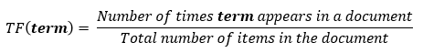
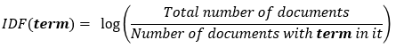
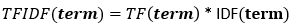

# Natural Language Processing #

This is a process of getting a computer to analyse large amounts of strings. There are two equations to be aware of:





- TF shows the frequency in current document|Kv
- ITF shows how rare the word is across documents
- TF-IDF score shows how relevant the word is in the documents

## Tokenization ##

A computer isn't good at analysing a bunch of strings, so we need to turn the strings into a 'bag of words'. This is done by converting the string into a vector i.e.

```
John likes to watch movies. Mary likes movies too.
```

Would become:

```
BoW1 = {"John":1,"likes":2,"to":1,"watch":1,"movies":2,"Mary":1,"too":1};
```

This makes it easier to calculate the variance amognst the words.

## Stemming ##

Stemming is a natural language processing technique that lowers inflection in words to their root forms, hence aiding in the preprocessing of text, words, and documents for text normalization.

An example of stemming would be with the words

```
running, ran, run
```

Two of these words are just variations on the work run, so the computing will convert these into libraries into the work run

## Vectorization ##

This is the process of getting the computer to compare similar words and sentences.

The words and messages are turned into a 2-D matrix, which shows the number of times a work appears in a certain message. The algorithm then treats this is a 'sparse matrix' which is a basically a method of dealing with matrices with large numbers of 0s. The principle is very simple, the computer only stores the none-zero values. This saves a large amount of memory on the computer

Once this is done it makes it easier to analyse the data.

## Levenshtein Distance ##

A string metric for measuring the difference between two sequences. Minimum number of single character edits:

- Insertions
- Deletions
- Subsitutions

Required to change one work into another. This is highly useful in understanding if works are similar
