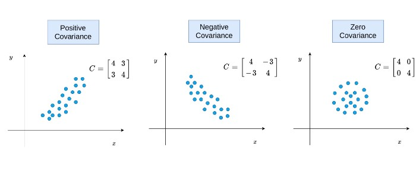
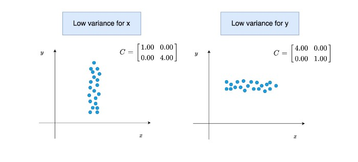
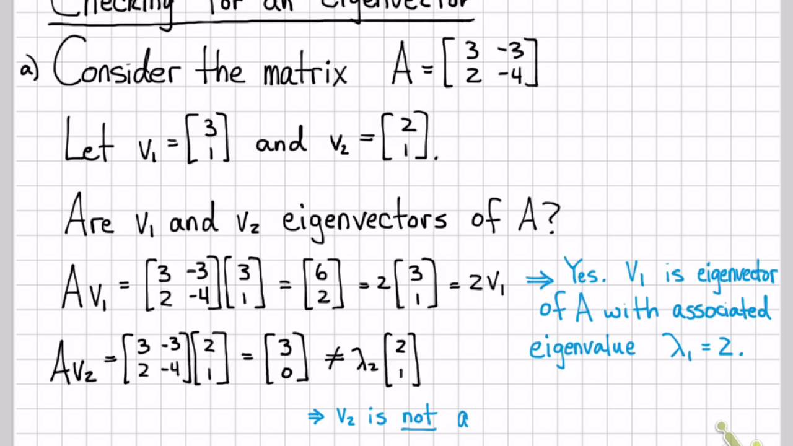
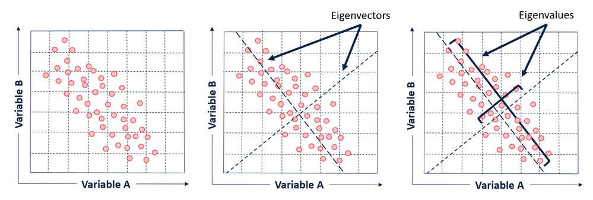
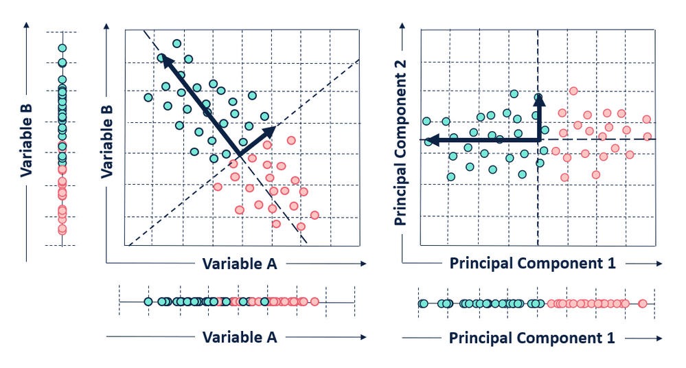
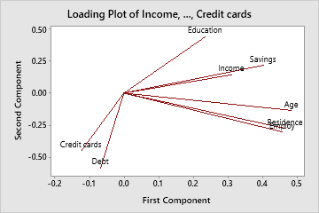

# Principle Component Analysis

Unsupervised machine learning alogithm which uses right-angled lines to the line of best fit. This algorithm is best used for multivariant data and when high dimensionlity makes it hard to plot anything insightful. PCA reduces the dimensionality and allows the convert the data into a lower-dimensionality dataset.

Use cases for PCA:

- Makes data easy to explore and compresses
- Face recognitiion, reduces complextiy when analysing faces
- Reduce noise within a dataset

Once you create this lower-dimensionality plot a user is able to sort dinemsions in order of importance and discard low significant dimensions.

Here are the steps involved in a PCA model:

- Standardise/normalise the dataset. Plot the data around the 0 position on the graph.
- Calcualte the covariance matrix; this is a formulae that tells the model about the spread and oreintation of the data in two dimensions (always in two dimensions). 

- Because the covariance matrix is a linear relationship we can perform eigendecomposition. The Eigenvalues and eigenvectors are then calcualted. For a refresher on what these are;

- Eigenvector tells you the  direction 
- Eigenvalue tells you the magnitude

For some unkown reason this helped me:

Together with these two values you're able to know the direction and magnitude of the data. The largest eignevector will point in the direction of the largest variance, and the second largest eigen vector will point in the direction of the second largest spread of the data. That leads to values that look like this:

- We then plot these vectors on the scaled data. Essentially we compare how far away each datapoint is from the eigenvalue/vectors. Note: number of columns = number of principle components. If there are four column you get PC1 - PC4. But we are only interesed in PC2 and PC1 as these are the highest correlated values.

On this specific example, the ouput doesn't look that impressive, but the final result can show a real cluster of data. If we take an example I found online in which we are trying to find the hightest correlating attributes to long term financial stabiliy.

PCA was performed and this was the resulting plot

